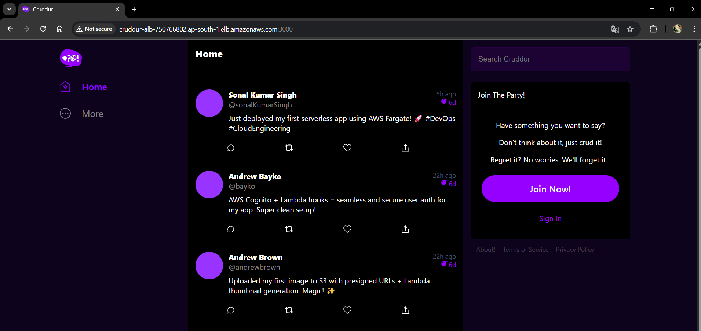

# AWS Cloud Project Project

- Application: Cruddur

# 🌐 Cruddur – Ephemeral Micro-Blogging Platform

---

Cruddur is a cloud-native, ephemeral-first micro-blogging platform built using a **modern AWS stack**. Designed for scale, security, and learning real-world cloud practices.

## 🚀 Live Demo  
🌐 [Visit Cruddur](http://cruddur-alb-750766802.ap-south-1.elb.amazonaws.com:3000/)

---

## 🛠️ Tech Stack
- **Frontend**: React + S3 + CloudFront
- **Backend**: Flask + Docker + ECS Fargate
- **Auth**: Amazon Cognito + Lambda Hooks
- **API**: AWS AppSync + GraphQL + Lambda Resolver
- **DB**: Amazon RDS + DynamoDB
- **CI/CD**: CodePipeline + CodeBuild + CloudFormation
- **Media Upload**: S3 + Lambda + API Gateway
- **Caching**: Momento
- **Monitoring**: CloudWatch, Rollbar, Honeycomb, X-Ray

---

## 🧠 Architecture Diagram 
- [ ] [Architecture](https://lucid.app/lucidchart/fbd6c6bd-ad1b-4d71-a520-b5d3e10fad33/edit?viewport_loc=-1521%2C-3651%2C4192%2C1955%2C0_0&invitationId=inv_4a703e12-0cc7-4e71-9882-d333a9972d9c)

## 🧑‍💻 Author

**Sonal Kumar Singh**  
📧 sonalkumar2790@gmail.com  
[LinkedIn](https://www.linkedin.com/in/sonal-kumar-singh-5b5b171a4/) | [GitHub](https://github.com/sonalkrsingh)

---
